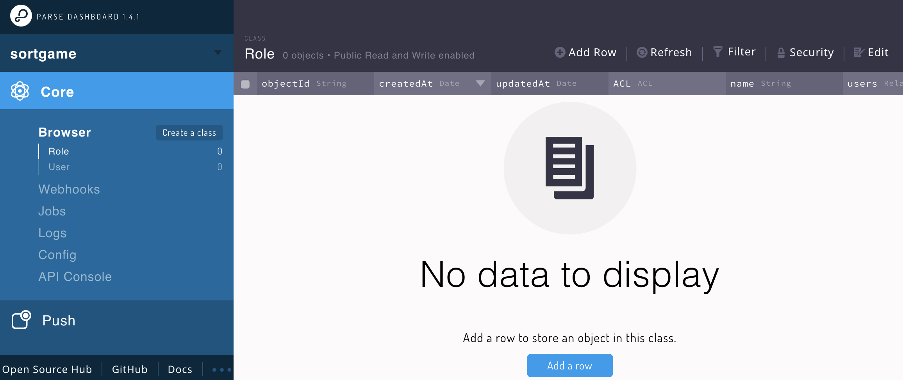
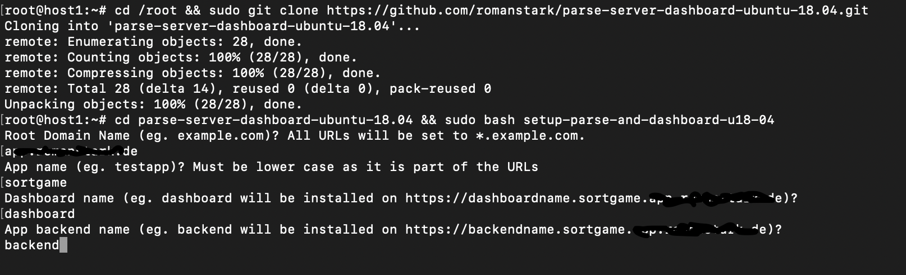
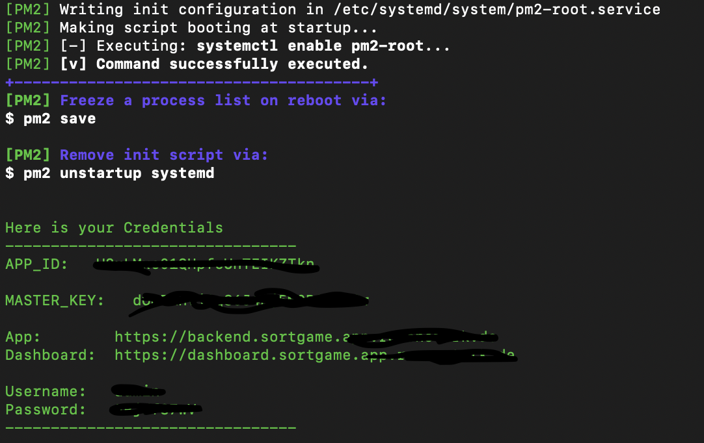

# Automated installation fo Parse-Server and Parse-Dashboard on Ubuntu-18.04 LTS

Shell scripts and config files to install Parse Server and Dashboard on Ubuntu 18.04 LTS.



# Howto

Clone this repository into your home folder and run the shell script.
On a fresh Ubuntu 18.04 installation please install git before you start.
You net to setup A-Records for you domain. E.g. \*.example.com or the named subdomains you are going to choose during setup

```
cd /root && sudo git clone https://github.com/romanstark/parse-server-dashboard-ubuntu-18.04.git
cd parse-server-dashboard-ubuntu-18.04 && sudo bash setup-parse-and-dashboard-u18-04 && cd ..
```



After successful Installation your Credentials shows (take a copy to notepad and save it.).
you can login to Parse Dashboard. (username is admin)



## Features

> Letsencrypt SSL

> parse-server@3.8.0

> parse-dashboard@2.0.1

> mongodb-runner@4.7.2

> Nginx 1.14.0

> Node.js v11.15.0

> pm2@3.5.1

## Author

Roman Stark

[](https://paypal.me/romanstark)

This script is based on https://github.com/bajpangosh/Install-Parse-Server-on-Ubuntu/tree/master/ubuntu-18.04 from Bajpan Gosh – bajpan@kloudboy.com. Thank you for the good work.

## Need App Development?

Please see https://www.vanedler.de

## NEED HELP?

Support via Email

email: mail@romanstark.de
web: https://www.romanstark.de

# What's missing

- Add option to don't setup parse dashboard as the dashboard may be used on different locations and hosts.

## Thanks

Roman Stark
